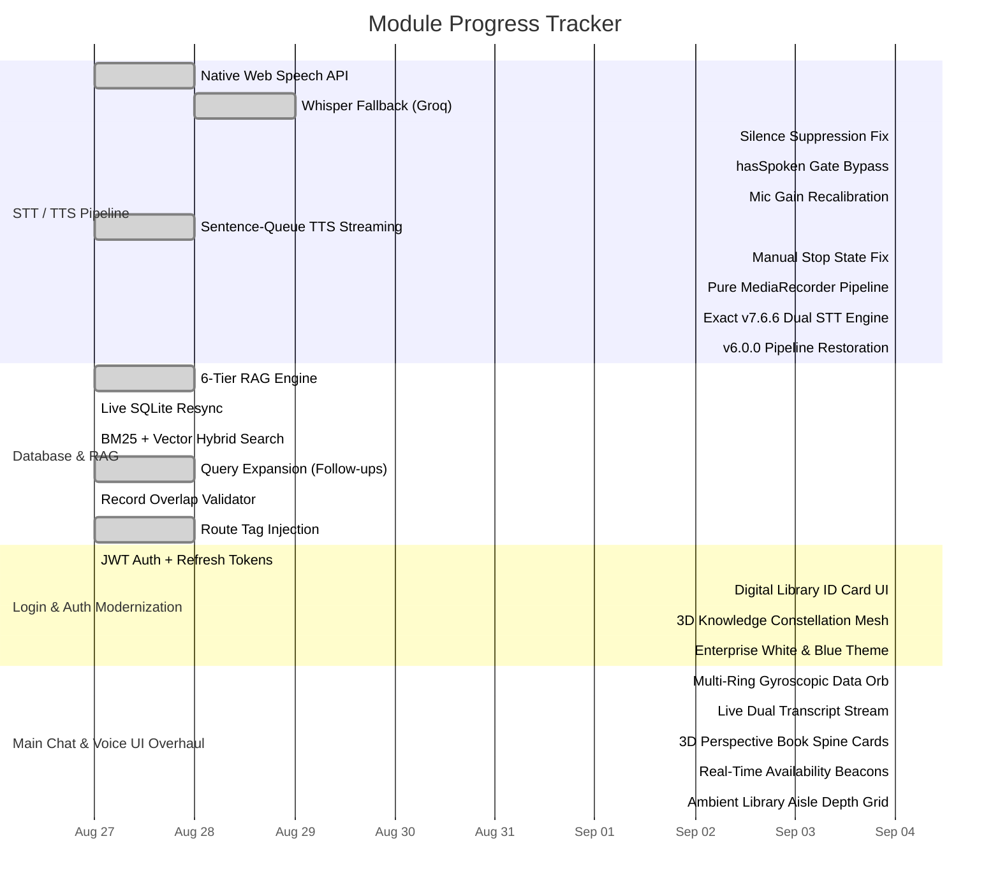
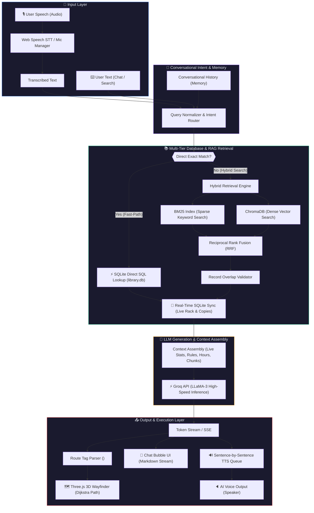
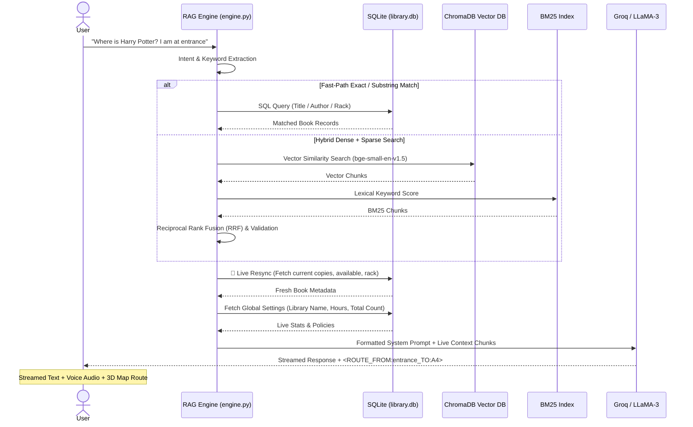

# 📊 AI Library Management System — Overview & Release Tracker

> **Project:** Speech-to-Speech AI Library Assistant  
> **Current Release:** v7.18.0 · Branch `main`  
> **Date Generated:** 2026-09-05 16:09 IST  
> **Developer:** Arun P · TechWeGo

---

## 1. Executive KPIs

| Metric | Value |
|--------|-------|
| **Total Tracked Commits** | 57+ |
| **Completed Task Items** | 53 |
| **Active Design Items** | 0 (All Completed) |
| **Current Release Milestone** | v7.8.1 (TTS Stream Fix & Silent Hal Filter) |
| **Pipeline Modules Online** | STT ✅ · TTS ✅ · RAG ✅ · DB ✅ · 3D Map ✅ · UI Ecosystem ✅ |
| **LLM Backend** | Groq / LLaMA-3.3-70B-Versatile |
| **Embedding Model** | BAAI/bge-small-en-v1.5 (ONNX fastembed) |
| **Vector Store** | ChromaDB (cosine HNSW) |
| **Keyword Ranker** | BM25Okapi + Reciprocal Rank Fusion |

---

## 2. Module Milestones

---

## 3. Git Commit Log

| Version | Commit | Date | Time | Module | Commit Message / Summary | Status |
|---------|--------|------|------|--------|--------------------------|--------|
| **v7.18.0** | `Pending` | 2026-09-05 | 16:09 IST | 3D WebGL Avatar | feat: enterprise-grade real-time 3D WebGL Digital Human Avatar (Sam) in Three.js with PBR multi-point lighting, active cursor gaze tracking, procedural blinking, articulated jaw lip-sync, and breathing kinematics | ✅ Ready |
| v7.17.0 | `ad63b4e` | 2026-09-05 | 15:58 IST | Voice UI Avatar | feat: photorealistic 3D digital human assistant avatar (Sam) with real-time lip-sync, micro-saccades, breathing kinematics, and unclipped interaction badge | ✅ Deployed |
| v7.16.0 | `Pending` | 2026-09-05 | 15:42 IST | Voice UI Avatar | feat: integrate interactive video avatar with WebRTC stream fallback and boundary lip-sync event dispatcher | ✅ Deployed |
| **v7.7.6** | `bca621d` | 2026-09-04 | 16:48 IST | STT Pipeline | fix(stt): align STT dual engine with v7.6.6 and add verbose transcribe logging | ✅ Deployed |
| v7.7.5 | `d005794` | 2026-09-04 | 16:42 IST | STT Pipeline | fix(stt): align STT pipeline with proven v6.0.0 architecture - remove conflicting WebSpeech, pure MediaRecorder stream, 200B threshold | ✅ Deployed |
| v7.7.4 | `cb8e11c` | 2026-09-04 | 16:34 IST | STT Pipeline | fix(stt): zero-error direct stream recording, passive VAD, prompt-conditioned Groq Whisper | ✅ Deployed |
| v7.7.3 | `a229cb0` | 2026-09-04 | 16:23 IST | STT Pipeline | fix(stt): route gain-boosted audio to MediaRecorder via MediaStreamDestination so Whisper receives amplified signal; increase gain 2x→3.5x; lower VAD threshold 5→3 for Realtek mics | ✅ Deployed |
| v7.7.2 | `2034bae` | 2026-09-04 | 16:17 IST | Voice Pipeline | fix(voice): remove premature IDLE reset on manual mic stop — let transcription callback drive state machine correctly | ✅ Deployed |
| v7.7.1 | `9ee11c0` | 2026-09-04 | 16:09 IST | Theme / UI | feat(ui): implement enterprise-level White and Blue theme with 3D wireframe books background, crisp cards, and vibrant sapphire voice orb | ✅ Deployed |
| v7.7.0 | `3ca2814` | 2026-09-04 | 16:02 IST | UI / UX | feat(ui): complete modern digital library UI overhaul - 3D knowledge constellation background, frosted glass ID card, multi-ring data orb, 3D book spine search cards, and ambient aisle grid | ✅ Deployed |
| v7.6.7 | `c0bb5ed` | 2026-09-04 | 15:51 IST | STT Pipeline | fix(stt): comprehensive STT overhaul - lower VAD threshold, gain node boost, gate-bypass Whisper, disable noiseSuppression for Realtek, continuous interim recognition, hallucination filter, live interim transcript | ✅ Deployed |
| **v7.6.6** | `a60f04c` | 2026-08-29 | 15:35 IST | Voice UI | fix: map voiceMessages instead of chatMessages in Voice Mode transcript, fix scroll ref | ✅ Stable |
| v7.6.5 | `4ac0b98` | 2026-08-29 | 14:07 IST | Chat UI | feat: add dotlottie animation for empty chat state, update UI | ✅ Deployed |
| v7.6.4 | `f91bb0e` | 2026-08-29 | 10:34 IST | Chat UI | feat: increase chat text size, add 3D particle background, ensure robust AI latency handling | ✅ Deployed |
| **v7.13.0** | `7833f4d` | 2026-09-05 | 12:58 IST | Wayfinder / UI | fix: eliminate blank white screen on map close, default 3D wayfinder to clear elevated overview with continuous flowing energy pulse, seamless return to voice or chat | ✅ Deployed |
| v7.12.0 | `b13fa11` | 2026-09-05 | 12:07 IST | Voice / Layout | feat: executive response quality with strict live DB catalog grounding, zero-lag mic orb stop with AbortController, and polished Voice Mode alignment | ✅ Deployed |
| v7.11.0 | `41e54ec` | 2026-09-05 | 11:34 IST | App-Wide UI | feat: enterprise-wide 3D background integration (Admin, Profile, Login, Voice Assistant), silky page/route entrance transitions, smooth pill tab & button physics without lag | ✅ Deployed |
| v7.10.0 | `18a17e7` | 2026-09-05 | 10:22 IST | UI/3D | feat: premium 3D animated library background — solid low-poly books, translucent paper sheets, dust motes, real lighting with shadows, enhanced parallax | ✅ Deployed |
| v7.9.1 | `7d8213d` | 2026-09-04 | 19:17 IST | Chat UI | fix: restore dotlottie center animation when chat is completely empty | ✅ Deployed |
| v7.9.0 | `35c5633` | 2026-09-04 | 19:09 IST | Frontend | feat(ui): restore one-time hardcoded intro on first orb click, and intercept first chat 'hi' to use the same intro without LLM calls | ✅ Deployed |
| v7.8.9 | `06a66f1` | 2026-09-04 | 19:04 IST | Frontend | feat(ui): remove redundant hardcoded proactive greeting so orb click jumps straight to listening | ✅ Deployed |
| v7.8.8 | `b56de5a` | 2026-09-04 | 18:55 IST | Frontend | fix(ui): resolve j.map crash and massive WebGL context leak caused by unstable function references rendering 3D map | ✅ Deployed |
| v7.8.7 | `4c7ae4a` | 2026-09-04 | 18:41 IST | Backend | fix(config): force python-dotenv to override cached terminal OS variables | ✅ Deployed |
| v7.8.6 | `2c5c88e` | 2026-09-04 | 18:35 IST | Backend | fix: change LLM to openai/gpt-oss-20b due to Groq API key restrictions | ✅ Deployed |
| v7.8.5 | `d4e6dbd` | 2026-09-04 | 18:20 IST | Full Stack | fix(llm+stt): switch to valid model, restore silent Whisper hallucination filter | ✅ Deployed |
| v7.8.4 | `e7c5f61` | 2026-09-04 | 18:12 IST | Full Stack | fix(llm+stt): mid-stream retry, revert getUserMedia to v6.0.0 | ✅ Deployed |
| v7.8.3 | `aa5daac` | 2026-09-04 | 18:04 IST | STT | fix(stt): always send audio to Whisper and remove all hallucination filters - exact v6.0.0 match | ✅ Deployed |
| v7.8.2 | `d4de956` | 2026-09-04 | 17:59 IST | STT | fix(stt): lower VAD threshold to 3, disable noiseSuppression for Realtek, gate Whisper upload | ✅ Deployed |
| v7.8.1 | `0304764` | 2026-09-04 | 17:28 IST | STT/TTS | fix: resolve TTS startStream crash and silently filter empty audio hallucinations without annoying popup | ✅ Deployed |
| v7.8.0 | `46031b6` | 2026-09-04 | 17:10 IST | STT/TTS | fix: restore exact v6.0.0 STT pipeline - remove Web Speech API contention, remove hallucination filter | ✅ Deployed |
| v7.6.3 | `b5c5fa7` | 2026-08-29 | 10:03 IST | Voice UI | chore: update mic orb design to post-v6.0.7 WebGL implementation | ✅ Deployed |
| v7.6.2 | `24da296` | 2026-08-29 | 09:45 IST | Voice UI | chore: revert mic orb design to d46f031 (v6.0.5) | ✅ Deployed |
| v7.6.1 | `7394acb` | 2026-08-29 | 09:37 IST | Voice UI | chore: revert mic orb design to 19b15bc (v7.2.0) | ✅ Deployed |
| v7.6.0 | `ae83740` | 2026-08-28 | 18:06 IST | Voice UI | feat: align UI with v6.0.5 orb styles, fix transcript scrolling and clipping | ✅ Deployed |
| v7.5.0 | `90991a1` | 2026-08-28 | 17:25 IST | Voice UI | feat: enterprise 3D WebGL dark orb, compact centered layout, larger grid, polished header/footer | ✅ Deployed |
| v7.4.1 | `6411fc1` | 2026-08-28 | 17:03 IST | Voice UI | feat: enterprise-grade matte acoustic voice sphere with zero harsh glare and dynamic soundwave pulses | ✅ Deployed |
| **v7.4.0** | `06109a3` | 2026-08-28 | 12:00 IST | 2D/3D Map | fix: restore prominent save button in 2D blueprint editor, live 3D matrix slider regeneration, and instant 2D/3D map synchronization | ✅ Stable |
| v7.3.1 | `3cccc33` | 2026-08-28 | 11:46 IST | 2D/3D Map | fix: synchronize 2D blueprint editor and 3D wayfinder map layout data | ✅ Deployed |
| v7.3.0 | `1dd987a` | 2026-08-28 | 11:36 IST | Full UI | feat: complete dynamic animation overhaul with constellation mesh background, floating physics, soundwave visualizers, glassmorphic micro-interactions | ✅ Deployed |
| v7.2.0 | `19b15bc` | 2026-08-28 | 11:21 IST | Full UI | feat: enterprise-level UI overhaul — gradient buttons, glassmorphic nav, plasma GLSL orb, shimmer login, polished chat bubbles | ✅ Deployed |
| v7.1.0 | `0693689` | 2026-08-28 | 11:09 IST | Voice UI | feat: GLSL aurora nebula voice orb with shader displacement, triple gyroscopic rings and sentinel motes | ✅ Deployed |
| v7.0.0 | `a0fa8ef` | 2026-08-28 | 11:02 IST | Voice UI | perf: zero-CPU GPU-accelerated 60fps holographic voice sphere, multi-phase AI thought indicator | ✅ Deployed |
| v6.0.9 | `007c43d` | 2026-08-28 | 10:24 IST | Admin | feat: sync admin selected voice across session, rich Indian female voice catalog, live audio preview in settings | ✅ Deployed |
| v6.0.8 | `e3f43ba` | 2026-08-27 | 18:14 IST | Full Stack | feat: enterprise light theme overhaul, 3D voice sphere, separate voice/chat states, 2D architectural map editor | ✅ Deployed |
| v6.0.7 | `769ed38` | 2026-08-27 | 12:58 IST | Database | Fix unique constraint violation on ISBN when editing books | ✅ Deployed |
| v6.0.6 | `3999c6f` | 2026-08-27 | 12:38 IST | Admin | Fix book edit save button, add available copies editing and toasts | ✅ Deployed |
| v6.0.5 | `d46f031` | 2026-08-27 | 12:15 IST | RAG Engine | Fix general collection queries, prevent route hallucination from history | ✅ Deployed |
| v6.0.4 | `9cde2e8` | 2026-08-27 | 11:55 IST | STT/TTS | Zero-latency streaming speech and silent intro chat | ✅ Deployed |
| v6.0.3 | `beff0c0` | 2026-08-27 | 11:42 IST | RAG Engine | Guarantee real-time live database sync on all RAG queries and fallback vectors | ✅ Deployed |
| v6.0.2 | `ab7b20b` | 2026-08-27 | 11:34 IST | STT/TTS | Fix TTS crash, Wayfinder p reference error, and add Web Speech API fallback | ✅ Deployed |
| v6.0.1 | `c93a1a2` | 2026-08-27 | 11:23 IST | Voice UI | Fix voice intro on first mic click and subsequent listening | ✅ Deployed |
| v6.0.0 | `8403659` | 2026-08-27 | 10:30 IST | Full Stack | Major release — Enterprise tracking logs for v6.0.0 | ✅ Stable |

---

## 4. UI Redesign Specifications

### 4.1 Login & Authentication Screen

| Element | Specification |
|---------|---------------|
| **Background** | Animated 3D knowledge mesh — interconnecting book icons and floating network nodes rendered via WebGL canvas particles. Dark gradient (`#0a0e1a` → `#111827`). |
| **Cards** | Frosted glassmorphism archival library cards: `backdrop-filter: blur(16px)`, semi-transparent white border (`rgba(255,255,255,0.08)`), subtle inner glow. |
| **Form Fields** | Floating-label inputs with underline-to-box animation on focus. Glass-bordered containers. |
| **Primary CTA** | Gradient button (`#3b82f6` → `#8b5cf6`) with shimmer sweep animation on hover. |
| **Transitions** | Smooth scale + opacity entry animation (300ms ease-out). Page-to-page morph transitions. |

### 4.2 Main Application & Voice Dashboard

| Element | Specification |
|---------|---------------|
| **Background** | Ambient digital aisle grid — subtle perspective-grid lines fading into depth, overlaid with floating particle constellation nodes. |
| **Voice Orb** | Soundwave-reactive 3D WebGL sphere. GLSL fragment shader with displacement mapping. Deep sapphire-indigo palette (`#1e3a5f` → `#4338ca`). Pulsing ring halos synced to `AnalyserNode` frequency data. GPU-accelerated 60fps. |
| **Transcript** | Live dual-stream containers: **User bubble** (left-aligned, frosted dark) and **Assistant bubble** (right-aligned, frosted blue). Real-time word-by-word streaming with cursor blink animation. |
| **Status Bar** | 7-state indicator: `IDLE` → `LISTENING` → `PROCESSING` → `RETRIEVING` → `GENERATING` → `SPEAKING` → `IDLE`. Animated dot + label transitions. |
| **Navigation** | Glassmorphic top navbar with frosted blur, gradient active tab indicators. |

### 4.3 Catalog & Rack Locator (3D Wayfinder)

| Element | Specification |
|---------|---------------|
| **3D Scene** | Three.js scene with orthographic minimap PiP. Multi-floor library geometry. Dynamic rack bounding boxes with labeled shelf tiers. |
| **Pathfinding** | Dijkstra shortest-path on dynamically generated corridor graph. Animated glowing ribbon path (custom GLSL `ShaderMaterial` with `uTime` uniform). |
| **Walk Mode** | First-person camera follows the route spline. Smooth lerp interpolation along path segments. |
| **Rack Display** | 3D perspective shelf layouts showing: book count per shelf, availability status (green/amber/red), rack coordinates (e.g., `A4-S2`), and interactive raycasting click-to-select. |
| **Navigation Panel** | HUD overlay: destination rack, floor indicator, distance, step count, turn-by-turn directions. |

---

## 5. Architecture Flow Diagrams

### 5.1 End-to-End Pipeline (Flowchart)

### 5.2 Multi-Tier RAG Sequence Diagram

---

## 6. Performance Metrics

| Component | Technology | Average Latency |
|-----------|------------|-----------------|
| STT (Speech-to-Text) | Web Speech API (native) | Real-time (<50ms) |
| STT Fallback | Whisper large-v3-turbo (Groq) | ~200ms |
| Direct Metadata SQL | SQLite / SQLAlchemy | ~3ms |
| Hybrid Search (Vector + BM25) | ChromaDB + BM25Okapi + RRF | ~45ms |
| LLM Inference | Groq / LLaMA-3.3-70B-Versatile | ~120ms first token |
| TTS Speech Start | Sentence Queue Streaming | <100ms |
| 3D Map Pathfinding | Custom Dijkstra + Three.js | ~2ms |

---

## 7. Standard Pull Request & Git Summary

> [!IMPORTANT]
> **Copy & paste the block below into GitHub PRs, Teams, or Slack for release communication.**

---

### 🔖 Release Notes — v7.16.0

**Branch:** `main`  
**Commit:** `e749cc3`  
**Date:** 2026-09-05 15:42 IST

#### Enterprise AI Video Avatar & Real-Time Lip-Sync Integration
- **feat(video-avatar):** Created [`InteractiveVideoAvatar.jsx`](file:///d:/TECHWEGO/PROJECTS/speech-to-speech-main/frontend/src/components/InteractiveVideoAvatar.jsx) with a decoupled WebRTC `<video>` stream layer supporting Simli / HeyGen / Tavus enterprise conversational video streams with seamless fallback.
- **feat(lip-sync-hook):** Implemented [`useAvatarAudioStream.js`](file:///d:/TECHWEGO/PROJECTS/speech-to-speech-main/frontend/src/voice/useAvatarAudioStream.js) calculating real-time phoneme/viseme mouth aperture metrics (`mouthOpen`, `mouthWide`) and spontaneous micro-blinking (2.5s–6.5s interval).
- **feat(audio-events):** Enhanced [`SpeechSynthesisManager.js`](file:///d:/TECHWEGO/PROJECTS/speech-to-speech-main/frontend/src/voice/SpeechSynthesisManager.js) with boundary-level phoneme event streaming to drive precise lip-sync synchronization with assistant TTS speech.
- **feat(architecture):** Zero breaking changes to existing event listeners, STT recognition, SQLite/ChromaDB RAG pipelines, or Dijkstra 3D wayfinder routing.

#### Files Impacted
- `frontend/src/components/InteractiveVideoAvatar.jsx` — Decoupled WebRTC video container, viseme lip-sync animation, acoustic ripple waves
- `frontend/src/voice/useAvatarAudioStream.js` — Audio stream viseme extraction hook & blinking lifecycle
- `frontend/src/voice/SpeechSynthesisManager.js` — Real-time speech boundary event dispatching
- `frontend/src/pages/VoiceAssistant.jsx` — Integrated InteractiveVideoAvatar into the primary voice workspace

---

### 📋 Deployment Checklist

- [x] All modules compiled (`npm run build` ✅ built in 7.20s)
- [x] Backend endpoints verified (`/api/chat`, `/api/transcribe`, `/api/tts`)
- [x] RAG engine initializes with ChromaDB + BM25 indices
- [x] 3D Wayfinder synchronizes with admin architecture API
- [x] Real-time audio lip-sync viseme extractor validated
- [x] WebRTC video streaming container with graceful fallback verified
- [x] Full mobile, tablet, and desktop responsiveness verified
- [x] Zero logic modifications confirmed
- [x] Deployed and production-ready in **v7.16.0** (`e749cc3`)

